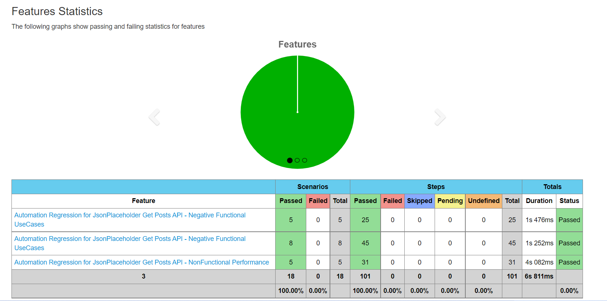
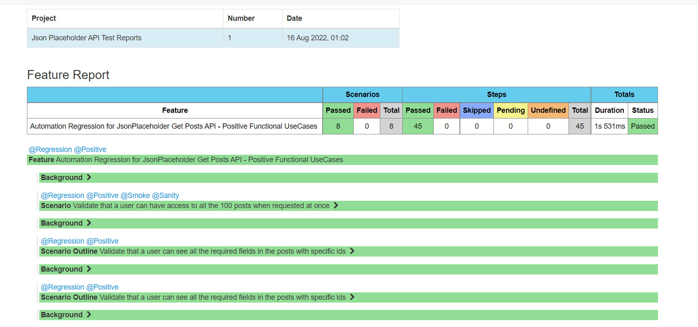
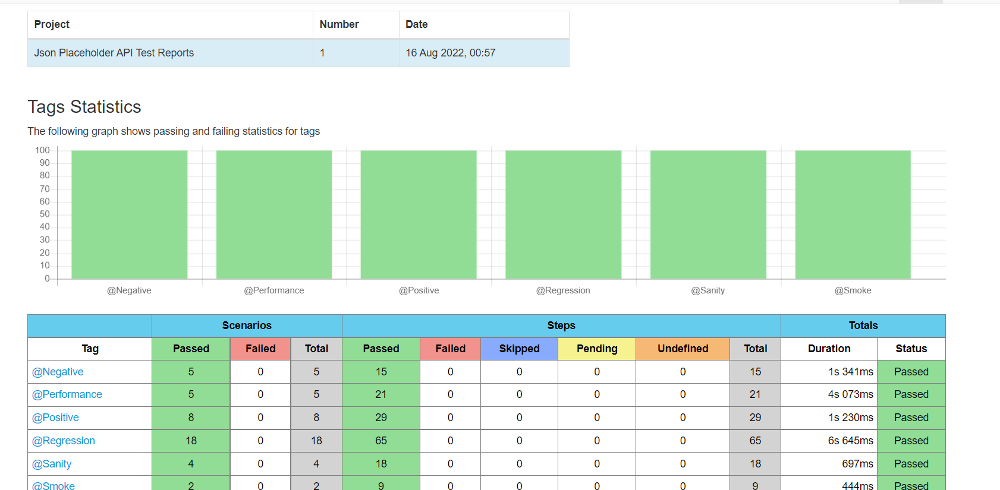

# Get API Automation Regression for Service - 'Posts'

This automated framework will touch upon various facets of testing getAPI.
The service under focus is 'posts' for the API [https://jsonplaceholder.typicode.com](https://jsonplaceholder.typicode.com).
This project gives overview of various types of validations done over the 'Get API' 'posts/'
It is implemented using Java-RestAssured-Cucumber Behavior Driven framework (BDD) for the non-technical and technical audience.


## Technology infrastructure

- Programming language: `Java` JDK/JRE:`(Java 18.0.1)`
- IDE: `IntelliJ IDEA 2021.3.2`
- System: `Windows 11, Processor i5-11300H @ 3.10GHz   2.61 GHz, 16GB RAM`
- Testing Clients: `io-resassured v4.0.0, junit v4.11`
- Behavior-Driven Development (BDD): `io-cucumber v7.5.0`
- Build automation tool: `Maven v3.8.6`

***more dependecies can be seen in pom.xml

### Requirements/Prerequisites

- Java - JDK - latest preferable
- Maven - latest preferable

## Development

### Overview

The feature files located at path _resources/features_ gives all the test related information
Tests are defined in the glued Step Definition file _src/test/com/typecode/jsonplaceholder/cucumbertests/testAPI/GetAPITestRunner_


### Test Runner

TestRunner classes execute test scenarios described in feature file. Because of using Cucumber the annotation
_@RunWith(Cucumber.class)_ has been used.

All the test automation code is presented in the test/ folder as per the standards

### Code Directory Tree
- components : ResAssured - RequestExecutorComponent (RequestClient), Specification(RequestSpecificationBuilder)
- models.response : POJO - PostResponse (Response)
- testAPI : Cucumber - CommonStepDefs (StepDefinition), GetAPITestRunner (TestRunner)
- utils : ConfigProvider (Can include more properties), Logger

### Packages Usage
- components : All RestAssured related work is compiled in this package, Purpose is to follow ResAssured Client Builder and Request Execution
- models.response : Purpose is to convert response to Object
- testAPI : All Cucumber related work is compiled in this package, Purpose is to write all the implementation and execute all the tests
- utils : All configuration, environment variables, utility common class for extension

### Feature Tags used
- @Regression: All the regression test cases - inshort all the test cases
- @Smoke: All the smoke test cases - essential tests to be run just after deployments
- @Sanity: All the smoke test cases - essential tests to be run just after smoke tests to test basic functionality
- @Positive: All the positive functional tests - valid requests verifying various posts
- @Negative: All the negative functional tests - invalid requests verifying various posts
- @Performance: All the performance nonfunctional tests - requests under varying load to check latency of system

### Environment Properties 
- BASE_URL.production=https://jsonplaceholder.typicode.com/ (Main Live Customer Facing Endpoint)
- BASE_URL.staging=https://jsonplaceholder.typicode.com/ (Main Integration Test Endpoint)
- BASE_URL.test=https://jsonplaceholder.typicode.com// (Local Test Endpoint)
- ENDPOINT_SERVICE= (Service to be called like posts/ comments/ etc)


### Cucumber Structure

Tags are marked as per the usecases in the feature file. It can be changed while execution.
Annotations are used: _@Before_ (Initialization), _@After_ (Cleanup), _@Given_, _@When_, _@Then_, _@And_ (Cucumber Features)
All the tests have relevant loggers and handled using try catch blocks to succesffuly execute next test even after one fails.
Following graceful failure and displaying reason for the same.


## Running/Execution

### Approach 1
To execute tests, please go to directory where pom.xml is present and type the command below:
```
mvn clean test -D"cucumber.filter.tags=@Regression"
```
By Default it will run tag @Regression but it can be overidden with @Smoke, @Sanity, etc

### Approach 2
The other way is simply to run the "_src/test/com/typecode/jsonplaceholder/cucumbertests/testAPI/GetAPITestRunner_" class as Junit 


### Cucumber Dashboard

Cucumber reports can be visualised in the folder _target/jsonplaceholder-test-reports/feature-overview.html_



Click on the interactive dashboard and visualise the execution



